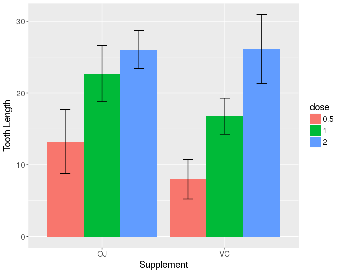

# ggBrackets
A ggplot2 layer for drawing brackets annotated with p-values and significance 
testing between barplot samples.

## Author

Alex Azzo  
<azzoa@vcu.edu>

## What is it

**ggBrackets** is a very small R package which allows the adding of
brackets and significance testing between samples/observations in
ggplot2, a simple task which I found difficult and finicky to accomplish 
natively in ggplot.  ggBrackets was specifically written for use with 
geom_bar() and has not been tested thoroughly with other geometries yet.  

## Features

The two primary functions in **ggBrackets** are:

1. `gg_bracket_between()` - draws the bracket between two samples  
2. `gg_ttest_between()` - peforms a 2-sample t-test and displays the
resulting p-value on the plot

A third function, `gg_value_between()`, allows user specified text to appear 
between bars.  This gives the flexibility to use the output of any statistical 
method in R with ggBrackets.

Some features of the package are:

- Support for grouped or non grouped bargraphs natively  
- Option to display either p-values or several levels of stars
to indicate significance  
- Automatic height adjustment based on the height of the two bars  
- Easy `extra_y_space` parameter to fine tune the vertical location of
the brackets/p-values  
- Utilizes its own `t_test2` function which allows summary statistics
(mean, sd, n) in the dataframe to be used instead of sample vectors  
- Support for both equal (Student's) and unequal variance (Welch) t-test  

That's about it!

## Installation

The best way to install **ggBrackets** right now is by first installing
the `devtools` R package.

```r
install.packages('devtools')
library(devtools)
```

And then install the latest version from the Github repository using
`install_github`.

```r
install_github('azzoam/ggBrackets')
```

## Data preparation

**ggBrackets** is designed to work with 'tidy data' formatting guidelines
where

1. Each variable is in a column  
2. Each observation is a row  
3. Each value is a cell

Data formatted in this way is also the most convenient to use with 
ggplot2 anyways.  Additionally, `gg_ttest_between()` requires

1. One column containing observation means data  
2. One column containing observation standard deviation data  
3. One column containing the n (number of replicates) of the observation

## Basic Usage

```r
library(ggplot2)
library(ggBrackets)

# Data from ToothGrowth built in R dataset
data("ToothGrowth")
ToothGrowth$dose <- as.factor(ToothGrowth$dose)
ToothGrowth$supp <- as.factor(ToothGrowth$supp)

tg <- data.frame()
for(dose in levels(ToothGrowth$dose)) {
    for(supp in levels(ToothGrowth$supp)) {
        len_mean <- mean(ToothGrowth[ToothGrowth$dose == dose & ToothGrowth$supp == supp, 'len'])
        len_sd <- sd(ToothGrowth[ToothGrowth$dose == dose & ToothGrowth$supp == supp, 'len'])
        len_n <- length(ToothGrowth[ToothGrowth$dose == dose & ToothGrowth$supp == supp, 'len'])
        tmp_df <- data.frame(len_mean, len_sd, len_n, supp, dose)
        tg <- rbind(tg, tmp_df)
    }
}
rm(dose, supp, len_mean, len_n, len_sd, tmp_df)

# Standard grouped ggplot bargraph with error bars
p <- ggplot(tg, aes(x = supp, y = len_mean, fill = dose)) +
    geom_bar(stat = 'identity', position = 'dodge') +
    geom_errorbar(aes(ymax = len_mean + len_sd, ymin = len_mean - len_sd),
                  position = position_dodge(width=0.9), width = 0.25) +
    xlab('Supplement') +
    ylab('Tooth Length')


# Minor theme tweaks for viewability 
p <- p + theme(plot.title = element_text(size = 24, hjust = 0.5),
               axis.title = element_text(size = 14),
               axis.text = element_text(size = 12),
               legend.text = element_text(size = 12),
               legend.title = element_text(size = 14))

# Default ggplot2 bargraph
p

```



```r
# With ggBrackets
p + 
    # Between OJ-dose1 and OJ-dose2
    gg_bracket_between(data = tg, sample_col = 'supp', sample1 = 'OJ', sample2 = 'OJ', 
                       mean_col = 'len_mean', group_col = 'dose', group1 = 1, group2 = 2,
                       extra_y_space = 5) +
    gg_ttest_between(data = tg, sample_col = 'supp', sample1 = 'OJ', sample2 = 'OJ', 
                     mean_col = 'len_mean', sd_col = 'len_sd', n_col = 'len_n', group_col = 'dose',
                     group1 = 1, group2 = 2, extra_y_space = 5)

```


```r
# Multiple brackets
p + 
    # Between OJ-dose1 and OJ-dose 2
    gg_bracket_between(data = tg, sample_col = 'supp', sample1 = 'OJ', sample2 = 'OJ', 
                       mean_col = 'len_mean', group_col = 'dose', group1 = 1, group2 = 2,
                       extra_y_space = 5) +
    gg_ttest_between(data = tg, sample_col = 'supp', sample1 = 'OJ', sample2 = 'OJ', 
                     mean_col = 'len_mean', sd_col = 'len_sd', n_col = 'len_n', group_col = 'dose',
                     group1 = 1, group2 = 2, extra_y_space = 5) +
    # Between VC-dose1 and VC-dose 2
    gg_bracket_between(data = tg, sample_col = 'supp', sample1 = 'VC', sample2 = 'VC', 
                       mean_col = 'len_mean', group_col = 'dose', group1 = 1, group2 = 2,
                       extra_y_space = 5) +
    gg_ttest_between(data = tg, sample_col = 'supp', sample1 = 'VC', sample2 = 'VC', 
                     mean_col = 'len_mean', sd_col = 'len_sd', n_col = 'len_n', group_col = 'dose',
                     group1 = 1, group2 = 2, extra_y_space = 5) +
    # Between OJ-dose2 and VC-dose2
    gg_bracket_between(data = tg, sample_col = 'supp', sample1 = 'OJ', sample2 = 'VC', 
                       mean_col = 'len_mean', group_col = 'dose', group1 = 2, group2 = 2,
                       extra_y_space = 10) +
    gg_ttest_between(data = tg, sample_col = 'supp', sample1 = 'OJ', sample2 = 'VC', 
                     mean_col = 'len_mean', sd_col = 'len_sd', n_col = 'len_n', group_col = 'dose',
                     group1 = 2, group2 = 2, extra_y_space = 10)

```


```r
# With stars instead of p-values
p + 
    # Between OJ-dose1 and OJ-dose 2
    gg_bracket_between(data = tg, sample_col = 'supp', sample1 = 'OJ', sample2 = 'OJ', 
                       mean_col = 'len_mean', group_col = 'dose', group1 = 1, group2 = 2,
                       extra_y_space = 5) +
    gg_ttest_between(data = tg, sample_col = 'supp', sample1 = 'OJ', sample2 = 'OJ', 
                     mean_col = 'len_mean', sd_col = 'len_sd', n_col = 'len_n', group_col = 'dose',
                     group1 = 1, group2 = 2, extra_y_space = 5, p_value_star = T) +
    # Between VC-dose1 and VC-dose 2
    gg_bracket_between(data = tg, sample_col = 'supp', sample1 = 'VC', sample2 = 'VC', 
                       mean_col = 'len_mean', group_col = 'dose', group1 = 1, group2 = 2,
                       extra_y_space = 5) +
    gg_ttest_between(data = tg, sample_col = 'supp', sample1 = 'VC', sample2 = 'VC', 
                     mean_col = 'len_mean', sd_col = 'len_sd', n_col = 'len_n', group_col = 'dose',
                     group1 = 1, group2 = 2, extra_y_space = 5, p_value_star = T) +
    # Between OJ-dose2 and VC-dose2
    gg_bracket_between(data = tg, sample_col = 'supp', sample1 = 'OJ', sample2 = 'VC', 
                       mean_col = 'len_mean', group_col = 'dose', group1 = 2, group2 = 2,
                       extra_y_space = 10) +
    gg_ttest_between(data = tg, sample_col = 'supp', sample1 = 'OJ', sample2 = 'VC', 
                     mean_col = 'len_mean', sd_col = 'len_sd', n_col = 'len_n', group_col = 'dose',
                     group1 = 2, group2 = 2, extra_y_space = 10, p_value_star = T)

```


Works great for single group bar graphs as well, simply leave out the group parameters.

```r
# Single group graph
tg_oj <- tg[tg$supp == 'OJ', c('dose', 'len_mean', 'len_sd', 'len_n')]

p <- ggplot(tg_oj, aes(x = dose, y = len_mean)) +
    geom_bar(stat = 'identity') +
    geom_errorbar(aes(ymax = len_mean + len_sd, ymin = len_mean - len_sd),
                  width = 0.25) +
    xlab('OJ dose') +
    ylab('Tooth Length')
    
p <- p + theme(plot.title = element_text(size = 24, hjust = 0.5),
               axis.title = element_text(size = 14),
               axis.text = element_text(size = 12),
               legend.text = element_text(size = 12),
               legend.title = element_text(size = 14))

p +
    # Between dose1 and dose2
    gg_bracket_between(data = tg_oj, sample_col = 'dose', sample1 = 1, sample2 = 2, 
                       mean_col = 'len_mean', extra_y_space = 5) +
    gg_ttest_between(data = tg_oj, sample_col = 'dose', sample1 = 1, sample2 = 2, 
                     mean_col = 'len_mean', sd_col = 'len_sd', n_col = 'len_n', extra_y_space = 5)

```


